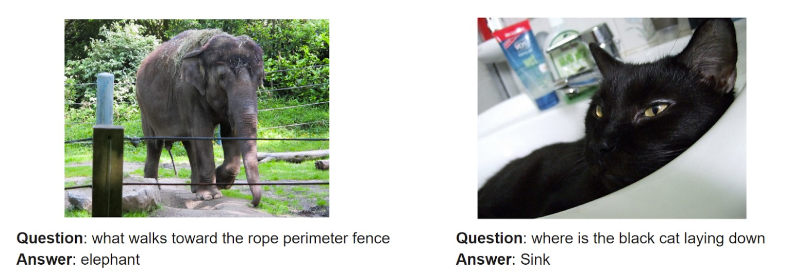

# Visual Question Answering

This project is the second phase of a two phase project aimed at improving AI’s understanding of
images. In phase one, we successfully developed an automatic image captioning model capable of
ingesting an image and generating descriptive textual captions. This solution addressed the problem
of insufficient labeling in large image databases and enhanced text-based search, image visibility, and
search relevancy in databases. In phase two, the focus of this report, we developed a Visual Question
Answering (VQA) model to address the weaknesses of the image captioning model, namely that
it could only describe what is seen in the image but is incapable of further analysis. VQA will go
beyond the basic captioning and be receptive to simple questions posed about the image to further
enhance user interaction, improve accessibility, and close the gap between human-like understanding
and AI understanding of images.

In the field of VQA, significant advancements have been made in machine learning architectures
to better facilitate the integration of visual and textual input. One of the earliest integrations of
a Convolutional Neural Network (CNN) and Long Short-Term Memory Network (LSTM) was
demonstrated by Malkinowski and Fritz to feed visual features into a language model for VQA. In 2015, two large datasets were introduced to the field: ‘The VQA Dataset’ and ‘COCO-QA’. Each of these created a much larger training set than previously available, allowing for a
more comprehensive dataset for model training. In the same year, Ren, M., Kiros, R., & Zemel, R.
performed a comparative study of leading model architectures on these datasets demonstrating strong
performance in model testing. This project will build on this field by enhancing the performance
of one main model architecture.

In phase one we leveraged the MS COCO Captions Dataset which contains over one and a half
million captions describing over 330,000 images. The dataset’s images consist of many common
items such as animals, people, and vehicles in different situations with varying perspectives. For
phase two, we use an augmented version of the COCO Captions dataset developed by the University
of Toronto, which provides close to 120,000 question-answer pairs for images in the COCO Captions
dataset, which is called COCO-QA. The questions fall into four distinct categories: object
identification, number, color, and location; each question being associated with a concise one-word
answer. Examples of images in the dataset are shown in Figure 1.

The VQA model employs a four-stage neural network architecture. A CNN image encoder will
process the image and encode it to a fixed length feature vector. In parallel to the image encoder, the
question will be processed by a textual encoder to another fixed length feature vector. These two
encodings will be merged together through matrix multiplication before being fed to the final LSTM
decoder which will process the merged image and question embeddings to generate an answer to the
posed question.

We evaluate the success of our project by evaluating our predicted answers in comparison to the
gold-standard answers given by our dataset. We have two metrics for evaluation: pure accuracy and
the Wu-Palmer Similarity (WUPS). Pure accuracy indicates the percentage of times that our
model will predict the exact same word as the gold-standard answer. While interesting, this does
not provide a good measure of overall accuracy because it does not take into account questions that
could have multiple correct answers. To account for this, the WUPS measure will find the similarity
between two words based on their longest common subsequence in the taxonomy tree. Our goal for
the WUPS measure was a range of 0.4 - 0.6, indicative of a well performing model. We achieve a
final WUPS measure of 0.66. We further implemented a model playground website and a chrome
extension to assess the capabilities of our models: ImageInteract.
